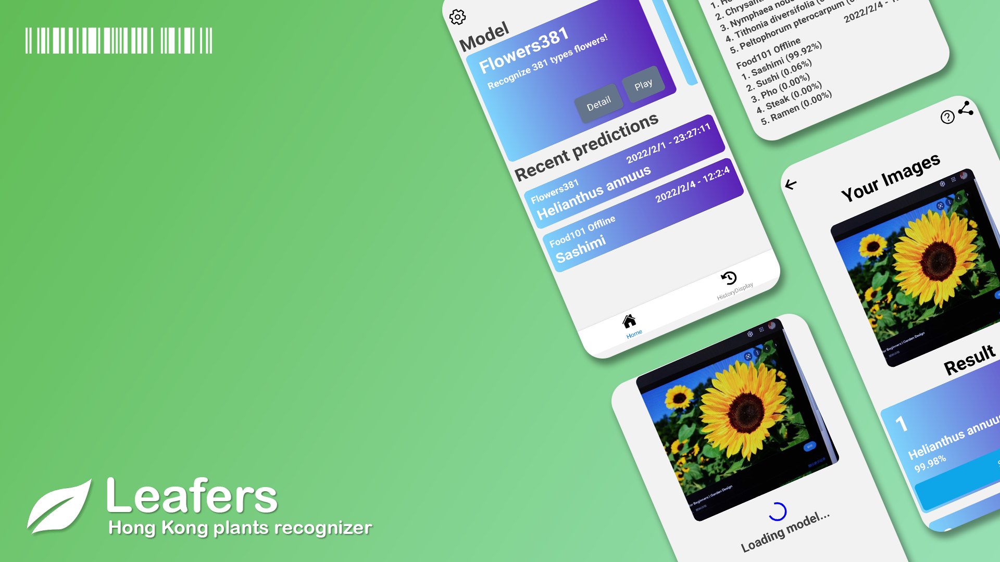

# 🍃 Leafers
A final year project of using deep learning CNN models for predicting Hong Kong plants images.    

   

[Leafers website](https://leafers.vercel.app/) | [Google Play](https://play.google.com/store/apps/details?id=leafers.apk&pcampaignid=pcampaignidMKT-Other-global-all-co-prtnr-py-PartBadge-Mar2515-1) | [GitHub](https://github.com/r48n34/leafers)  

  

## 📊 Dataset

### 🌸 flower400
Dataset that contains 400 types of flowers occur in Hong Kong. (86880 images)        
https://www.kaggle.com/r48n34/flower400   
 
### 🌳 flower258
Dataset that contains 258 types of flowers occur in Hong Kong, group by genus. (86880 images)    
https://www.kaggle.com/r48n34/flower258  

### 🏞 flower yolov5  
Using flower400 images, selecting few of representative for labeling with boxes.  
https://www.kaggle.com/r48n34/flowers-yolov5

## 💪 Training params

### 📸 Images classifications 

**👠 Model choosing**:    
`Tensorflow 2.8 EfficientNetV2` & `EfficientNet` & `MobienetV3 series`    

**🔪 Data spliting**:    
`80% Training` & `20% Validations`    

**📈 Max scale mtehod**:  
Scale up all classes that below a number of the max images classes  

**📈 Max scale Flower400 / Flower258**:  
Training    - 276550 images   
Validations - 7369 images  

### 🔍 Object detections  

**👠 Model choose**:  
yolov5 small 

**📈 Data**:  
Training    - 1067 images     
Validations - 100 images  

### 🌲 Environments

| Specs \ Env | Colab ENV                      | Local ENV                                |
|-------------|--------------------------------|------------------------------------------|
| CPU         | Intel(R) Xeon(R) CPU @ 2.30GHz | AMD Ryzen 5 5600X 6-core 3.7GHz (4.5 OC) |
| GPU         | NVIDIA Tesla P100 16GB         | MSI GeForce RTX 3060 Ti 12GB             |
| RAM         | 24 GB                          | 16 GB DDR4 3200                          |
| CUDA        | 11.2                           | 11.5                                     |
| TF version  | 2.7                            | 2.8                                      |

## 💪 Training result

### 🌳 flower258
| Code  | Aug                    | Method                       | Scale          | Train Top1 | diff  | Predict Top1 | Predict Top5 |
| ----- | ---------------------- | ---------------------------- | -------------- | ---------- | ----- | ------------ | ------------ |
| 10    | max scale + RandAug    | Official effNetv2b1          | 240, \[0,255\] | 8436       | \-96  | 8340         | 9495         |
| 11    | max scale + RandAug    | MobienetV3                   | 224, \[0,255\] | 8073       | \-173 | 7900         | 9339         |
| ex    |                        | 9,10,11 Sum output           |                |            | N/A   | 7963         | 9383         |
| ex    |                        | 9,10,11 Voting               |                |            | N/A   | 7835         | N/A          |
| 12    | max scale + Nornal Aug | effNetv1b3                   | 300, \[-1,1\]  | 8403       | \-637 | 7766         | 9273         |
| 14    | max scale + RandAug    | Official effNetvb2           | 260, \[0,255\] | 8313       | \-175 | 8138         | 9442         |
| 15    | max scale + RandAug    | Official effNetvb0           | 224, \[0,255\] | 8752       | \-90  | 8662         | 9583         |  

### 🌸 flower400
| Code  | Aug                    | Method                       | Scale          | Train Top1 | diff  | Predict Top1 | Predict Top5 |
| ----- | ---------------------- | ---------------------------- | -------------- | ---------- | ----- | ------------ | ------------ |
| 13    | max scale + RandAug    | Official effNetv2b3          | 300, \[0,255\] | 7323       | \-100 | 7223         | 9279         |
| 16    | max scale + RandAug    | Official effNetv2b0          | 224, \[0,255\] | 7316       | \-88  | 7228         | 9257         |
| 17    | max scale + RandAug    | 13,16 stacking               | 300, \[0,255\] | 7602       | \-51  | 7551         | 9375         |
| 18    | max scale + CutMix     | Official effNetv2b1          | 240, \[0,255\] | 7363       | \-354 | 7009         | 9183         |
| 19    | none                   | Official effNetb0            | 224, \[0,255\] | 7417       | \-328 | 7089         | 8604         |
| 20    | RandAug cont 19 model  | Official effNetb0            | 224, \[0,255\] | 7445       | \-390 | 7055         | 8482         |
| [21](model/flower400Code021model)    | max scale + RandAug    | Official effNetv2b1          | 240, \[0,255\] | 7417       | \-111 | 7306         | 9330         |
| [22](model/flower400Code022model)    | max scale + RandAug    | 13,16,21 stacking            | 300, \[0,255\] | 7726       | +5    | 7731         | 9475         |

### 🏞 YoloV5 Best.pt

| train/box_loss | train/obj_loss | precision | recall | mAP_0.5 | mAP_0.5:0.95 | val/box_loss | val/obj_loss |
|----------------|----------------|-----------|--------|---------|--------------|--------------|--------------|
| 0.023474       | 0.023782       | 0.9516    | 0.77108| 0.87833 | 0.63541      | 0.031121     | 0.012252     |

# 💻 Applications development
**🌐 Website** :  
[React with Vite (Typescript, Firebase, tfjs, Mantine, redux RTK...)](frontendWeb/newTsVite)   

**🤖 Apps (Android)** :  
[React native with expo (tfjs)](nativeApps)  

**💻 Serverless API deploy** :  
[Azure functions](api)    

**📦 Frontend deploy**:  
[(Old) Azure static web app => (New) Vercel](https://vercel.com/)  

# 👍 Special Thanks  

### 📷 Media:  
- [Startupbeat](http://startupbeat.hkej.com/?p=122323)   

### 📊 Data References: 
- [Hong Kong Herbarium](https://herbarium.gov.hk/en/about-us/news/whats-new/index-id-5.html)  
- [HKCWW](http://hkcww.org/hkplant/index.htm)    
- [Produce Green HK](http://www.producegreen.org.hk/hkwildflower/main_04_01.htm)    

### 📑 Protocol References:
- [Smart Flower Atlas](https://plant-tw.github.io/)      
- [Pl@ntNet](https://identify.plantnet.org/zh)     
